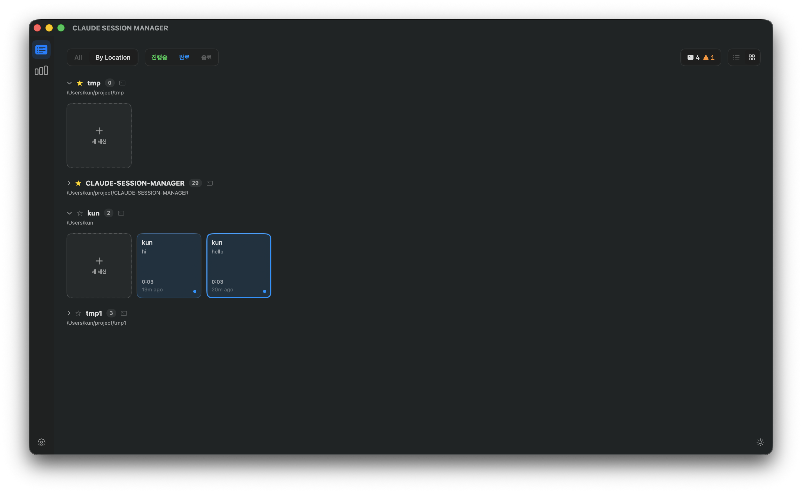
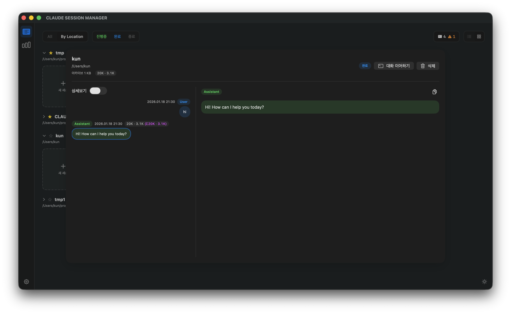
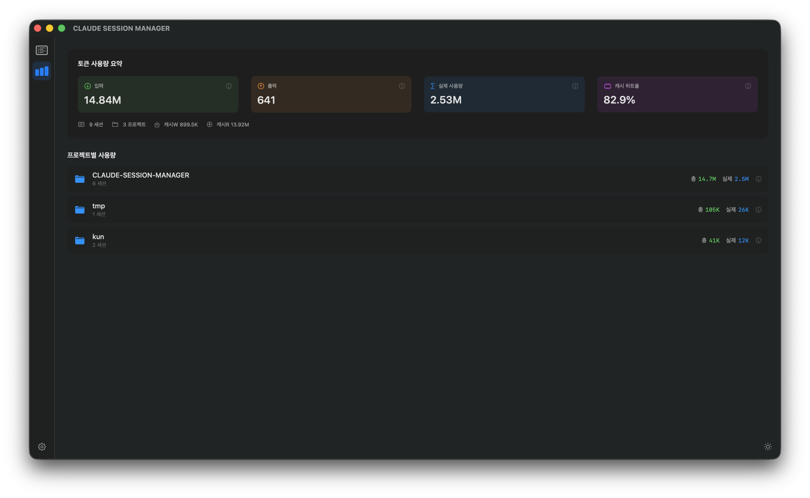
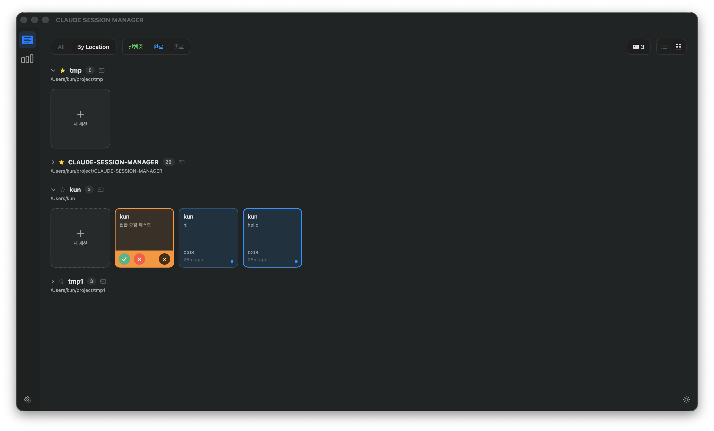
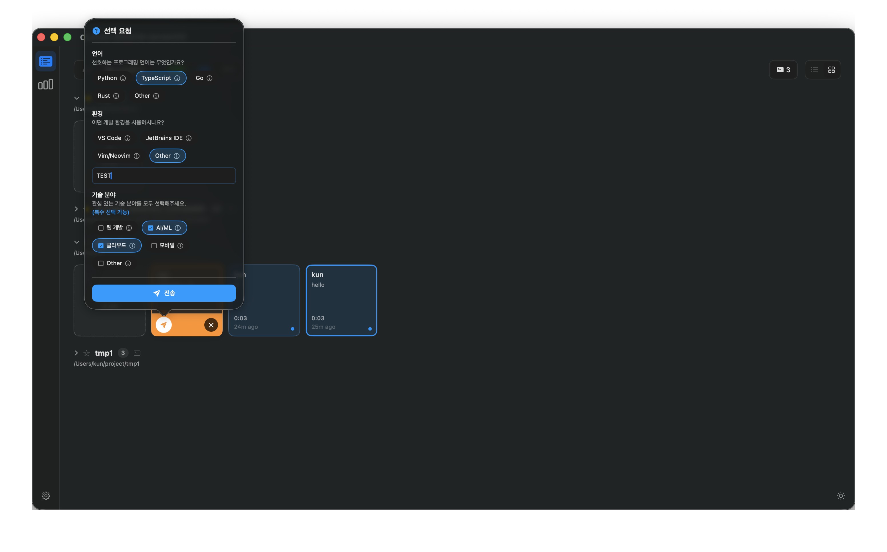

# Claude Session Manager


Claude Code 세션을 로컬에서 관리하는 macOS 네이티브 앱입니다.

## 개요
- 여러 세션을 동시에 돌리면 어디서 뭘 하는지 파악이 어려움
- 권한 요청이나 응답 완료를 놓치기 쉬움
- 토큰 사용량을 세션/프로젝트별로 추적할 방법이 없음
- 과거 대화를 다시 보려면 JSONL 파일을 직접 열어야 함

이 앱은 Claude Code의 **훅(hook) 시스템**과 **JSONL transcript 역공학**을 활용해 이 문제들을 해결합니다.

## Screenshots

| 세션 목록 | 세션 상세 | 통계 |
|:---:|:---:|:---:|
|  |  |  |

<details>
<summary>더 보기</summary>

| 권한 요청 | 선택 요청 |
|:---:|:---:|
|  |  |

</details>

## 핵심 기능

**세션 관리**
- 프로젝트별 세션 목록, 상태 필터 (진행중/완료/종료)
- 세션 카드에서 마지막 프롬프트/응답 요약 표시
- 터미널 연동: 세션 이어하기, 새 세션 시작, 디렉토리 열기

**대화 뷰어**
- JSONL transcript를 파싱해 전체 대화 내역 열람
- 메시지별 토큰 사용량 (입력/출력/캐시) 표시
- 누적 토큰 계산

**권한 요청 처리**
- Claude Code 훅에서 권한 요청 이벤트 수신
- 앱 내에서 허용/거부/취소 응답

**시스템 알림**
- 세션 상태 변경 (완료/권한 요청) 시 macOS 알림
- 알림 클릭으로 해당 세션으로 이동
- 사운드 옵션

**통계**
- 프로젝트별 토큰 사용량 집계
- 캐시 히트율, 실제 사용량 계산
- 로컬 영속화로 누적 추적

## 설치

### Homebrew (권장)

```bash
brew tap Kun-9/tap
brew install --cask claude-session-manager
```

Gatekeeper 경고가 나오면:

```bash
brew install --cask --no-quarantine claude-session-manager
```

또는 설치 후:

```bash
xattr -dr com.apple.quarantine /Applications/ClaudeSessionManager.app
```

### DMG

[Releases](../../releases)에서 최신 DMG를 다운로드하고 Applications로 드래그하세요.

## 시작하기

1. 앱을 실행하고 알림 권한을 허용합니다.
2. **Settings > Hooks > Apply Updates**를 클릭합니다.
3. 터미널에서 Claude Code 세션을 시작하면 앱에 자동으로 표시됩니다.

> 앱을 이동하면 훅 경로가 바뀌므로 Apply Updates를 다시 실행하세요.

## 작동 원리

**JSONL Transcript 역공학**

Claude Code는 세션 대화를 `~/.claude/projects/` 하위에 JSONL 형식으로 저장합니다.
이 앱은 해당 파일을 파싱하여 메시지 내용, 토큰 사용량, 도구 호출 등을 추출합니다.

**Hook 기반 이벤트 수신**

Claude Code의 [hooks](https://docs.anthropic.com/en/docs/claude-code/hooks) 기능을 활용합니다.

```
~/.claude/settings.json
├── hooks.PostToolUse    → 세션 상태 갱신, 통계 수집
├── hooks.Notification   → 시스템 알림 전송
└── hooks.PreToolUse     → 권한 요청 처리 (승인/거부)
```

앱 번들에 포함된 CLI가 훅에서 호출되어 이벤트를 처리합니다.

**파일 기반 IPC**

권한 요청은 파일 기반 IPC로 처리됩니다:
1. 훅 CLI가 `~/.claude-session-manager/permission/`에 요청 파일 생성
2. 앱이 파일 변경 감지 후 UI에 표시
3. 사용자 응답을 파일에 기록하면 CLI가 읽어서 Claude Code에 전달

## 로컬 저장소

모든 데이터는 로컬에만 저장되며 네트워크 없이 동작합니다.

| 데이터 | 경로 |
|--------|------|
| Claude 설정 | `~/.claude/settings.json` |
| Claude 세션 | `~/.claude/projects/` |
| 앱 아카이브 | `~/Library/Application Support/ClaudeSessionManager/archives/` |
| 통계 | `~/Library/Application Support/ClaudeSessionManager/statistics.json` |
| 권한 요청 IPC | `~/.claude-session-manager/permission/` |

## 권한

- **알림**: 세션 상태 변경 알림에 필요
- **자동화**: Terminal/iTerm2 제어 (세션 이어하기/새 세션 시작)에 필요

## 문제 해결

| 증상 | 해결 |
|------|------|
| 훅이 동작하지 않음 | Settings > Hooks > Apply Updates 재실행 |
| 알림이 안 옴 | 시스템 설정에서 알림 권한 확인 |

## License

MIT License. See `LICENSE`.
